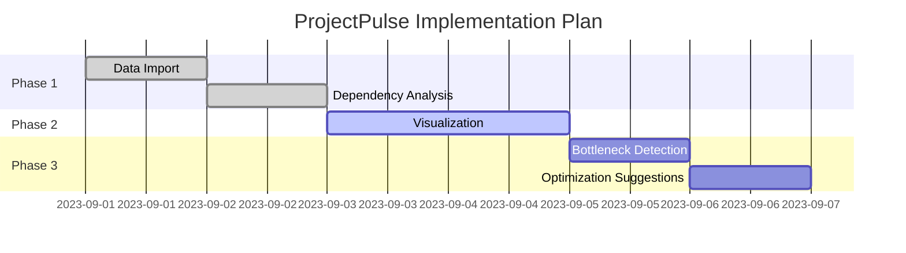
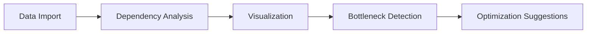
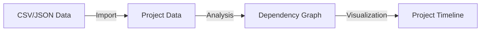
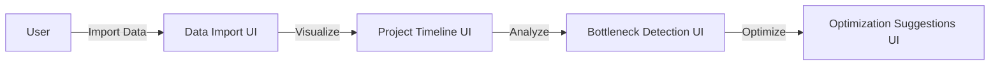

# ProjectPulse PRD

## Elevator Pitch
ProjectPulse is an innovative Java Desktop application designed to visualize project timelines and dependencies, empowering project managers like Sarah Collins to identify potential bottlenecks and optimize resource allocation. By leveraging H2 DB for data storage and JavaFX for the UI, ProjectPulse provides a robust and efficient tool for managing complex projects. This specialized solution addresses the gaps in existing tools by focusing on dependency analysis, bottleneck detection, and actionable optimization suggestions, making it easier for managers to reduce delays, control costs, and enhance team productivity.

## Executive Summary
ProjectPulse aims to revolutionize project management by providing a clear and intuitive visualization of project timelines and dependencies. By analyzing task dependencies and identifying potential bottlenecks, ProjectPulse enables project managers to make informed decisions about resource allocation and project scheduling. The application's robust architecture and user-friendly interface make it an ideal solution for project managers seeking to optimize their project plans.

In a market saturated with general-purpose task management tools, ProjectPulse stands out by specializing in timeline visualization and optimization. It targets mid-sized tech firms and similar organizations where project managers handle multiple complex projects. The application supports data import from CSV/JSON formats, builds dependency graphs, visualizes timelines interactively via JavaFX, detects bottlenecks using degree centrality algorithms, and offers tailored optimization strategies. With a one-week implementation plan and modular design, ProjectPulse is poised for quick development and future expansions, such as integrations with tools like Asana or Jira.

Key benefits include reduced project delays, lower cost overruns, improved stakeholder communication, and data-driven decision-making. Success will be measured by accurate data import, precise visualizations, reliable bottleneck detection, and relevant suggestions, all validated through rigorous testing.

## Problem Landscape
Project managers often struggle with understanding complex project dependencies and identifying potential bottlenecks. This can lead to delays, cost overruns, and reduced team productivity. The lack of a clear visualization tool makes it challenging for project managers to communicate effectively with stakeholders and make data-driven decisions.

Elaborating further, in dynamic environments like tech firms, projects involve interdependent tasks across teams, where manual tracking via spreadsheets or basic tools fails to highlight critical paths or resource conflicts. Without automated analysis, managers rely on intuition, increasing risks of missed deadlines. ProjectPulse addresses this by automating dependency graphing and bottleneck identification, providing visual insights that reveal hidden issues early in the planning phase.

## Market Analysis
The project management software market is highly competitive, with numerous players offering a range of solutions. However, many of these tools focus on task management and collaboration, neglecting the critical aspect of project timeline visualization. ProjectPulse fills this gap by providing a specialized tool for project managers to analyze and optimize their project plans.

### Competitive Landscape
Key competitors in the project management software market include:

* **Asana**: Strong in task assignment and collaboration but limited in advanced timeline visualization for complex dependencies.
* **Trello**: Board-based organization excels in simple workflows but lacks depth in bottleneck analysis or optimization.
* **MS Project**: Comprehensive for enterprise-level planning, yet it's often overly complex and expensive for mid-sized teams, with a steep learning curve.
* **Jira**: Ideal for agile development and issue tracking, but its timeline features are not specialized for dependency graphing or proactive bottleneck detection.

While these tools offer a range of features, they often lack the specialized functionality required for complex project timeline visualization. ProjectPulse differentiates itself by providing a dedicated solution for project managers, focusing on dependency analysis, bottleneck detection, and optimization suggestions. Its lightweight, desktop-based approach avoids subscription fees and cloud dependencies, appealing to users prioritizing data privacy and offline access.

### Business Justification
ProjectPulse offers a unique value proposition by providing a specialized tool for project managers to analyze and optimize their project plans. By addressing the critical aspect of project timeline visualization, ProjectPulse can help project managers reduce delays, cost overruns, and improve team productivity. The application's robust architecture and user-friendly interface make it an attractive solution for project managers seeking to optimize their project plans. From a business perspective, it targets a niche within the $15B+ project management software market (growing at 10% annually), where visualization tools represent an underserved segment. Early adoption could lead to partnerships or acquisitions by larger players.

## User Avatar
### Sarah Collins
Sarah Collins is a Senior Project Manager at a mid-sized tech firm, overseeing multiple projects simultaneously. She is responsible for managing project timelines, resource allocation, and stakeholder communication. Sarah is highly organized and detail-oriented, with a strong background in project management. She typically works in fast-paced environments with cross-functional teams, handling budgets up to $500K and timelines spanning 6-12 months.

#### Needs and Pain Points
* Visualize complex project timelines and dependencies to spot inter-task relationships at a glance.
* Identify potential bottlenecks and optimize resource allocation to prevent resource overloads or delays.
* Communicate effectively with stakeholders through clear, shareable visuals rather than dense reports.
* Make data-driven decisions about project scheduling, backed by automated insights instead of manual calculations.

Pain points include time wasted on manual dependency mapping, overlooked critical paths leading to surprises, and difficulty in justifying adjustments to executives without visual evidence.

#### Current Workflow
1. Manually create project timelines using MS Excel or MS Project, often exporting data from other tools.
2. Analyze task dependencies and identify potential bottlenecks through spreadsheets or whiteboards, which is error-prone.
3. Communicate with team members and stakeholders to adjust project plans, relying on meetings and emails for feedback.

This workflow is inefficient, taking hours per update and lacking real-time analysis.

#### Goals and Expectations
* Improve project timeline visualization and analysis for faster insights.
* Reduce delays and cost overruns by 20-30% through early bottleneck detection.
* Enhance team productivity and collaboration with intuitive tools.
* Make data-driven decisions about project scheduling, supported by optimization suggestions.

Sarah expects a tool that's quick to learn, integrates seamlessly with existing data formats, and provides actionable recommendations without requiring advanced technical skills.

## Solution Architecture
The ProjectPulse application will be built using Java for the desktop client and H2 DB for data storage. The architecture will include the following components:

* **Data Import Component**: Handles CSV/JSON import functionality, parsing files into structured ProjectData objects.
* **Dependency Analysis Component**: Analyzes task dependencies and builds dependency graph using graph algorithms.
* **Visualization Component**: Visualizes project timeline using JavaFX, supporting interactive elements like zooming and highlighting.
* **Bottleneck Detection Component**: Identifies potential bottlenecks in the project timeline via degree centrality or critical path methods.
* **Optimization Suggestions Component**: Provides optimization strategies based on detected bottlenecks, such as resource reallocation or task parallelization.

### Technical Specifications
* **Programming Language**: Java 17+ for cross-platform compatibility and performance.
* **Database**: H2 DB, an embedded SQL database for lightweight, file-based storage without external servers.
* **UI Framework**: JavaFX for rich, responsive desktop interfaces with support for charts and graphs.
* **Data Import**: CSV/JSON import functionality using libraries like OpenCSV or Jackson for parsing.
* **Graph Handling**: Custom DependencyGraph class, potentially leveraging libraries like JGraphT if needed (though kept minimal).
* **Algorithms**: Dependency analysis via graph construction; bottleneck detection using node degree thresholds (e.g., nodes with degree > threshold as bottlenecks).
* **Environment**: Desktop-only, no web or mobile components in v1; assumes standard JVM installation.

### Technical Summary
ProjectPulse employs a modular, layered architecture to ensure maintainability and scalability. At its core is an embedded H2 database for persisting project data, queried via JDBC. The backend logic is divided into analyzers and detectors, implemented in pure Java for efficiency. The frontend uses JavaFX scenes and controls to render timelines as Gantt-like charts or dependency graphs, with event handlers for user interactions.

Data flows from import to analysis: Raw CSV/JSON is parsed into Task objects (with attributes like ID, name, duration, dependencies), stored in H2, then graphed. Visualization renders this graph dynamically, while detection algorithms traverse it to flag issues. Optimization logic applies heuristics, such as suggesting parallel tasks for high-degree nodes.

This design minimizes dependencies, ensuring the app runs offline with low resource usage (target: <100MB RAM). Future-proofing includes extensible components for adding export features or AI-based optimizations.

### System Design
The application's system design will follow a modular architecture, with each component responsible for a specific functionality.

#### Data Import Component
The Data Import Component will handle CSV/JSON import functionality, parsing the data into a format suitable for analysis. It validates input for required fields (e.g., task ID, dependencies) and handles errors gracefully.

#### Dependency Analysis Component
The Dependency Analysis Component will analyze task dependencies and build a dependency graph, enabling the identification of potential bottlenecks. It constructs a directed acyclic graph (DAG) to model task precedence.

#### Visualization Component
The Visualization Component will visualize the project timeline using JavaFX, providing an intuitive and interactive representation of the project plan. Users can interact via drag-and-drop or filters.

#### Bottleneck Detection Component
The Bottleneck Detection Component will identify potential bottlenecks in the project timeline, using algorithms to analyze the dependency graph. For example, it calculates node degrees or longest paths.

#### Optimization Suggestions Component
The Optimization Suggestions Component will provide optimization strategies based on detected bottlenecks, enabling project managers to adjust their project plans accordingly. Suggestions might include "Reassign resources to Task X" or "Parallelize Tasks Y and Z."

## Feature Specifications
The following features will be included in the ProjectPulse application:

* **Data Import**: Ability to import project data from CSV/JSON files, supporting fields like task ID, name, start/end dates, duration, and dependencies.
* **Project Timeline Visualization**: Visual representation of the project timeline and task dependencies, using Gantt charts or network diagrams for clarity.
* **Bottleneck Detection**: Algorithm to identify potential bottlenecks in the project timeline, highlighting tasks with high impact on overall duration.
* **Optimization Suggestions**: Logic to suggest optimization strategies based on detected bottlenecks, such as adjusting timelines or reallocating resources.

### Use Cases
1. Importing project data from CSV/JSON files to populate the database.
2. Visualizing project timeline and dependencies to review overall structure.
3. Identifying potential bottlenecks during planning reviews.
4. Adjusting project plans based on optimization suggestions to mitigate risks.

### Constraints
* Data import format limited to CSV/JSON; no real-time syncing with external tools in v1.
* Project timeline visualization limited to JavaFX capabilities, such as basic 2D rendering without 3D or web embeds.
* Assumes acyclic dependencies; cyclic detection and resolution not included initially.
* Single-user desktop app; no multi-user collaboration features.

### Acceptance Criteria
1. Successful import of project data from CSV/JSON files, with 100% accuracy for valid inputs.
2. Accurate visualization of project timeline and dependencies, matching imported data.
3. Correct identification of potential bottlenecks, verified against sample datasets.
4. Relevant optimization suggestions provided, logical and actionable based on detection results.

## User Stories
The following user stories will guide the development of the ProjectPulse application:

* As a project manager, I want to import project data from CSV/JSON so that I can visualize my project's timeline.
* As a project manager, I want to visualize my project's timeline and dependencies so that I can identify potential bottlenecks.
* As a project manager, I want the application to suggest optimization strategies so that I can adjust my project plan accordingly.

These stories emphasize user-centric development, ensuring features align with Sarah's needs.

## Implementation Tasks
The implementation tasks will be divided into the following phases:

### Phase 1: Data Import (1 day)
* Implement CSV/JSON import functionality using parsing libraries and validation.

### Phase 2: Dependency Analysis (1 day)
* Develop algorithm to analyze task dependencies and construct the graph.

### Phase 3: Visualization (2 days)
* Implement JavaFX UI for project timeline visualization, including chart rendering.

### Phase 4: Bottleneck Detection (1 day)
* Develop algorithm to identify potential bottlenecks via graph metrics.

### Phase 5: Optimization Suggestions (1 day)
* Implement logic for suggesting optimization strategies based on analysis.

## Implementation Plan
The implementation plan will follow a phased approach, with each phase building on the previous one.

### Timeline
1. Day 1-2: Data import and dependency analysis.
2. Day 3-4: Visualization component development.
3. Day 5: Bottleneck detection and optimization suggestions.
4. Day 6-7: Testing and debugging.



### Resource Requirements
* 1 developer with Java and JavaFX expertise.
* 1 day for data import and dependency analysis.
* 2 days for visualization component development.
* 1 day for bottleneck detection and optimization suggestions.
* 2 days for testing and debugging.

### Success Metrics
* Successful import of project data from CSV/JSON files.
* Accurate visualization of project timeline and dependencies.
* Correct identification of potential bottlenecks.
* Relevant optimization suggestions provided.
* Zero critical bugs in final testing; 95% code coverage.

## Risk Assessment
The following risks have been identified:

* Delays in data import and dependency analysis due to parsing complexities.
* Issues with JavaFX visualization, such as rendering performance on large projects.
* Inaccurate bottleneck detection if algorithms fail on edge cases.
* Irrelevant optimization suggestions if heuristics are too generic.

### Mitigation Strategies
1. Regular progress monitoring and adjustments to the implementation plan, with daily check-ins.
2. Collaboration with team members to address technical issues, including code reviews.
3. Testing and validation of the application using diverse sample datasets and unit/integration tests.

## Code Snippets
The following code snippets demonstrate key aspects of the ProjectPulse application:

### Dependency Analysis
```java
public class DependencyAnalyzer {
    /**
     * Analyzes task dependencies and builds a dependency graph.
     *
     * @param data Project data containing tasks and dependencies.
     * @return Dependency graph representing task dependencies.
     */
    public DependencyGraph analyze(ProjectData data) {
        DependencyGraph graph = new DependencyGraph();
        data.getTasks().forEach(task -> {
            graph.addNode(task.getId());
            task.getDependencies().forEach(dependency -> graph.addEdge(task.getId(), dependency));
        });
        return graph;
    }
}
```

### Bottleneck Detection
```java
public class BottleneckDetector {
    /**
     * Identifies potential bottlenecks in the project timeline.
     *
     * @param graph Dependency graph representing task dependencies.
     * @return List of tasks identified as bottlenecks.
     */
    public List<Task> detectBottlenecks(DependencyGraph graph) {
        List<Task> bottlenecks = new ArrayList<>();
        graph.getNodes().forEach(node -> {
            if (graph.getDegree(node) > threshold) {
                bottlenecks.add(node);
            }
        });
        return bottlenecks;
    }
}
```

These snippets illustrate core logic; full implementation would include error handling and optimizations.

## Mermaid Diagrams
The following mermaid diagrams illustrate key aspects of the ProjectPulse application:

### Application Architecture


### Data Flow


### User Interaction Flow


These diagrams provide visual overviews of architecture, data processing, and user journeys, aiding in development and stakeholder understanding.

## Future Roadmap
The following features are planned for future development:

* Integration with popular project management tools (e.g., API sync with Asana or Jira).
* Support for multiple project visualization, allowing side-by-side comparisons.
* Enhanced optimization suggestions, incorporating machine learning for predictive analysis.

### Prioritization
The prioritization of future features will be based on user feedback and business requirements, starting with integrations to expand market reach.

## Conclusion
ProjectPulse is a comprehensive Java Desktop application designed to visualize project timelines and dependencies, empowering project managers to identify potential bottlenecks and optimize resource allocation. With its robust architecture, user-friendly interface, and specialized features, ProjectPulse is poised to revolutionize project management by addressing key pain points and delivering tangible efficiency gains.
